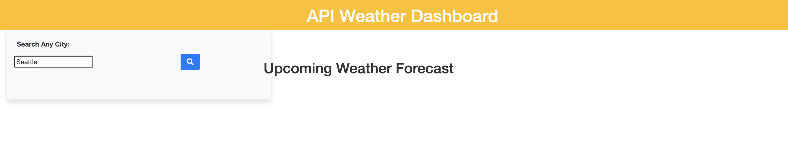

# weather-or-not-here-i-come
Weather dashboard that runs in the browser and features dynamically updated HTML and CSS

## Description

An application that anyone can use to manage their workday schedule.

- My goal for this project was use a third party API to allow a user to access weather data for a 5 day forecast in their preferred city. I wanted the user to be able to see the outlook for multiple cities of their choosing, be able to go back to their saved searches and access weather data again, and have the user be able to plan a trip accordingly from the accessed weather data.
- This project taught me a LOT of new skills related to server-side third party APIs. I learned how to call an API, access my own personalized key through the open weather API, allow users to save searches in local storage related to cities they are interested in viewing a 5-day weather forecast for, and view the temperature, current humidity, wind speed, and various upcoming weather conditions for cities of their choosing. 

## Link to Live WebPage

https://marleyschneiderr.github.io/weather-or-not-here-i-come/

## Installation

N/A

## Authors

Created by Marley Schneider, Github: https://github.com/marleyschneiderr

## Usage

This website was designed to serve a 5-day forecast weather application that provides the user with upcoming weather forecasts in any desired city.

## Credits

Created by Marley Schneider

## License

Please refer to the LICENSE in the repo.
